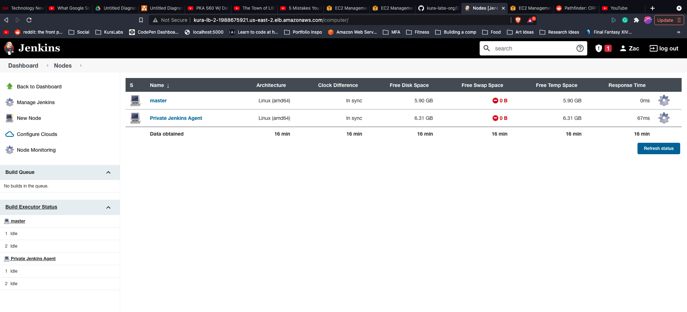
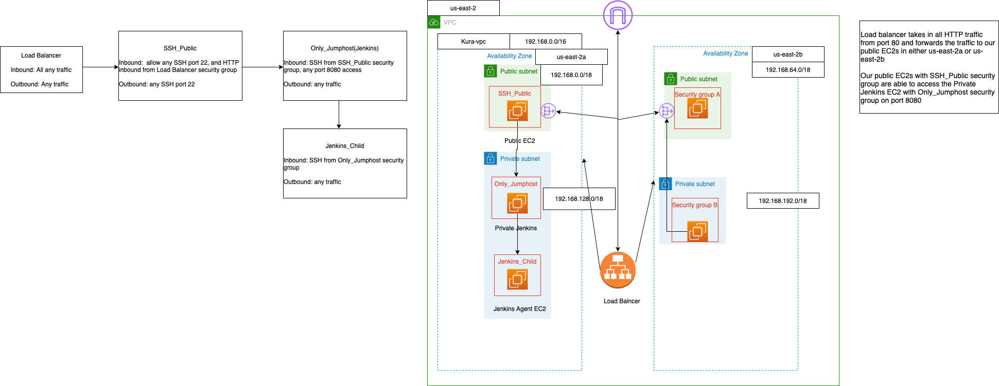

# Deployment 5 AWS

***Requirements:*** 
- [x]Create your network topology and submit the file to this repository.
- [x]Include security group rules you made, to your topology. Also include where you attached each policy.
- [x]Take a screenshot of you logged into your Jenkins master and the agent connecting to the Jenkins master(also include the Url in the screenshot).
- [x]One screenshot is required, so you have the option of choosing how you would like to submit it. 

👉Link to deployment instructions: [here](https://github.com/kura-labs-org/DEPLOY6_AWS/blob/main/Deployment%235.pdf)  

### Screenshots
- 
- 